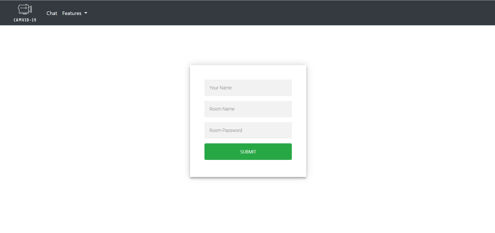
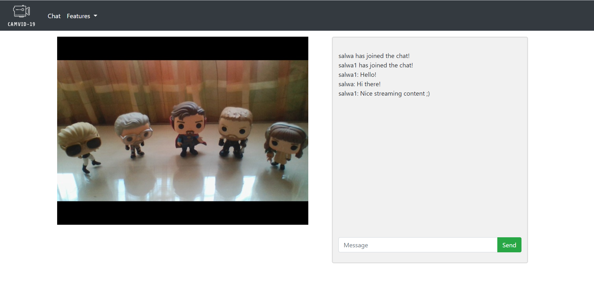
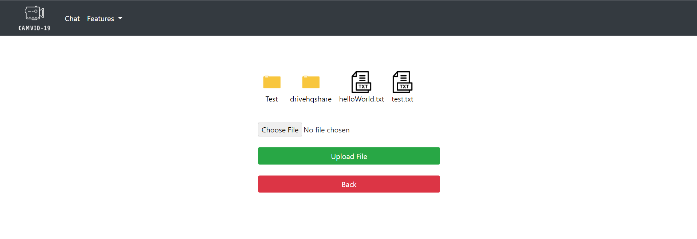
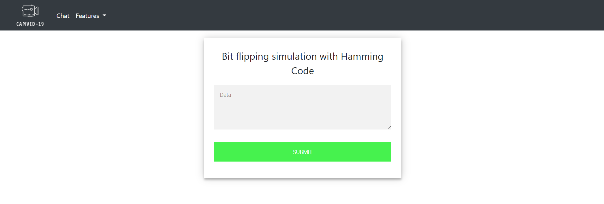
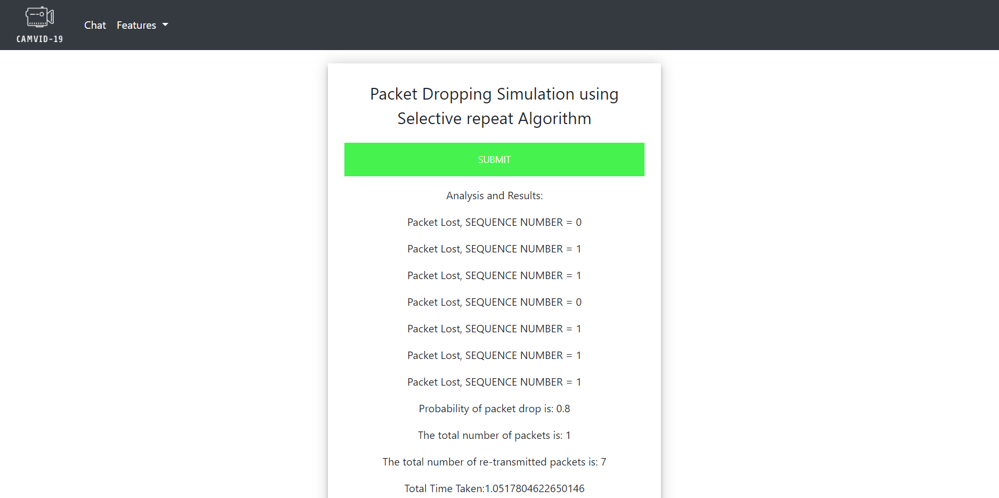

# CAMVID-19: A Web Streaming App

With the current [coronavirus](https://www.who.int/emergencies/diseases/novel-coronavirus-2019) situation, online learning has been gaining an increasing share of the educational systems in schools and universities. CAMVID-19 is a live streaming web application that aims to provide online content to many students at the same time. This platforms offers live streaming, file sharing, web chatting, and email services.

## Prerequisites

Before you continue, ensure you have met the following requirements:

1. You have installed the latest version of Python.

2. You have installed <code>flask</code>, <code>open-cv</code>, and <code>pyaudio</code>, and <code>sys</code> as follows:

```
pip install flask
```
3. You are using a Windows machine. Linux or Mac OS is not currently supported.

4. You have turned on the less secure app access in your google account, as shown below:

<p align="center"></p>

5. You have turned off your Windows Defender Firewall so that other devices can connect to your device and view the streaming.
 
## Installing

1. Change the ip address field to your ip address in <code>website\main2.py</code>.

```
host_ip = '192.168.XXX.XXX'
```
2. Run <code>server\server_chat.py</code>, <code>server\server_stream.py</code>, <code>server\server_audio.py</code>, and <code>server\selectiveServer.py</code> in separate terminals (make sure to be in the right directory) as follows:

```
python server_stream.py 
```

3. Run <code>website\main2.py</code> in another terminal.

4. The flask server is now up and running! In your browser, type in <code>http://127.0.0.1:5000/</code> to run the web app. The <code>login</code> page will prompt you to input your username, room name, and room password. The room refers to the classroom which includes the following features. The room name and password are authenticated with <code>Flask</code> using <code>SQLAlchemy</code>. To login, use 'Computer Networks' as room name and 'admin' as room password.

<p align="center"></p> 

## Features

### Video Streaming and Chatting

Streamed with a multi-client server on port <code>9000</code>, the frames are streamed to clients, where each client gets a thread. As for the chatting feature, the bits are streamed on port <code>5511</code>.

<p align="center"></p> 

### File Sharing

This feature supports both upload and download of TXT files, and it facilitates the navigation through the directory of files and folders.

<p align="center"></p>

### Podcast

Using <code>pyaudio</code>, the podcast feature streams audio on port <code>5858</code>. Connected devices can pause and resume this stream.

<p align="center"></p>

### Mail

This feature connects to the Gmail <code>SMTP</code> server on port <code>587</code>, logs in to your account with your credentials, and sends an email to the chosen destination email.

<p align="center"></p>

### Hamming Code Simulation

A family of linear error-correcting codes, Hamming codes are used to simulate bit flipping, error detection, and error connection. It can detect one-bit erros and correct them without detection of uncorrected errors. A maximum of one-bit error is introduced to the input text, detected, and then corrected. 

<p align="center"></p>

<p align="center"></p>

### Selective Repeat Simulation

This feature simulates a lossy channel through dropping packets based on a certain specified probability. The selective repeat algorithm retransmits the packets, and the data was sent from <code>send.text</code> to <code>receive.txt</code> free of errors. 

<p align="center"></p>

## Built With

* [Flask](https://flask.palletsprojects.com/en/1.1.x/) - Used to create a Flask web server from the Flask module.
* [OpenCV](https://opencv.org/) - To capture frames from the camera.
* [PyAudio](https://pypi.org/project/PyAudio/) - To record and stream audio.
* [SQLAlchemy](https://www.sqlalchemy.org/) - Login authentication with Flask and SQLAlchemy.

## Authors

* **Wafic Lawand** - [Github](https://github.com/waficLawand)
* **Salwa Al Khatib** - [Github](https://github.com/salwaalkhatib)

## References

* https://pythonspot.com/login-authentication-with-flask/
* http://code.activestate.com/recipes/580691-hamming-error-correction-code/
* https://github.com/BryceGo/Python-SMTP-Mail-Client
* https://github.com/techwithtim/Chat-Web-App
* https://github.com/miguelgrinberg/flask-video-streaming/tree/v1
* https://pythonprogramming.net/ftp-transfers-python-ftplib/
* https://github.com/ckshankar02/Selective-Repeat-ARQ
* https://gist.github.com/fopina/3cefaed1b2d2d79984ad7894aef39a68


## Acknowledgments

* Hat tip to [Tarek Naous](https://github.com/tareknaous) for naming the project.
